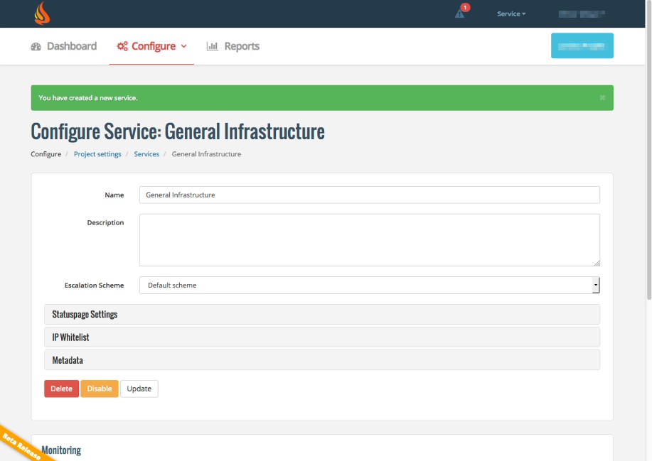

# icinga2-escalert

The icinga2 docker image from Jordan extended by escalert.io

## Usage

Escalert.io is an incident management system.

This Docker image integrates Escalert.io notifications into the icinga2 Docker image by Jordan Jethwa (https://github.com/jjethwa/icinga2).

## Setup in Icinga2 Director

Setting up Escalert notifications in Icinga2 Director requires some additional steps.

### Create Escalert Service

Log into your Escalert.io account. If you don't have an account, you can sign up here for free: https://escalert.io/frontend/user/register/

Now go to your Services and select "add:"

Enter a name for your service and click on "create":

The service is now created:

Now scroll down to "Monitoring" and click on the "URL API" tab. You will see some API commands containing the API key for your account.

Select the API key (2) from one of the URLs and copy it to the clipboard:

## Set up Icinga2 Director

Now log into your Icinga2 container and open Icinga Director. 

### Create a custom data field for your Escalert API key

Scroll down until you see the option "Define Data Fields". Select it.

Click on "Add" to create a new data field. Enter a field name in the input box to the right. You can enter any name you like, but we suggest you name it "escalert_api".
Also enter a descriptive caption, e.g. "Escalert API key".

### Create a Service Template

You can now create templates for all your services, add the new data field to each of them and fill it with the API key.

However, we suggest that you create just one Escalert-enabled service template with otherwise no  specific configuration, which you then import into all the service templates that you wish to be able send Escalert notifications.

Create a new service template and give it a meaningful name, e.g. "escalert".

Now click on "Fields" in the top bar (2) and create a new custom field.

Select the data field that you created in a previous step (3).

Go back to the "Service" tab. You should now see an entry under "Custom properties" with the newly added custom field. Paste the API key here.

### Import the Service Template into other templates

Select a service template that you would like to enable Escalert for. In this case, we choose the template called "https" .
In the "Imports" input box, select the Escalert service template created before.

The Escalert API key field will appear under "Custom properties". If you have multiple Escalert accounts, you may put a different API key here. If you don't, the service will inherit the API key value from the Escalert service template that you imported.

### Create a Host template

You can also create a new Host Template by the same pattern that we used for Service Template. Go to "Hosts" in Icinga Director (1), click on "Add" (2). The host name you enter (3) is arbitrary, but we recommend a meaningful name like "escalert".

The same way you did it with the Service Template, click on "Fields" and select the Escalert API key field for your new custom field.

Go back to the "Host" tab. Under "Custom properties", you will see the newly added custom field. In the input box, paste your Escalert API key.

### Import the Host Template into other templates

Now select any existing host template that you want to be able to send Escalert notifications. On the "Host" tab, go to the "Imports" input box and enter the name of the Escalert host template created in the previous step.
Again, the Escalert API key is inherited from the imported template, but you can overwrite it any time.

When you're finished, don't forget to deploy your changes by going to the "Activity Log" of Icinga Director and selecting "deploy pending changes".

## See also

https://escalert.io/en/frontend/support/docs/icinga2/

